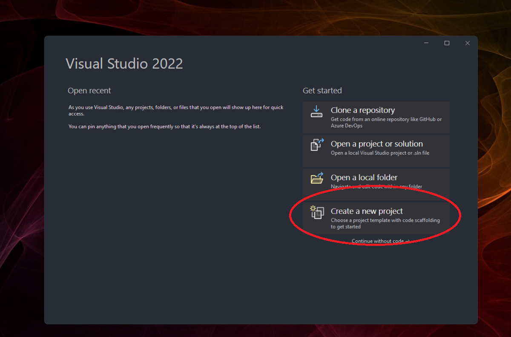
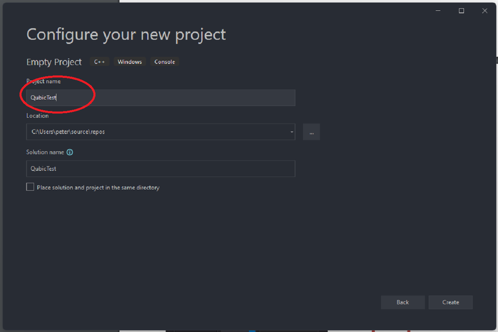
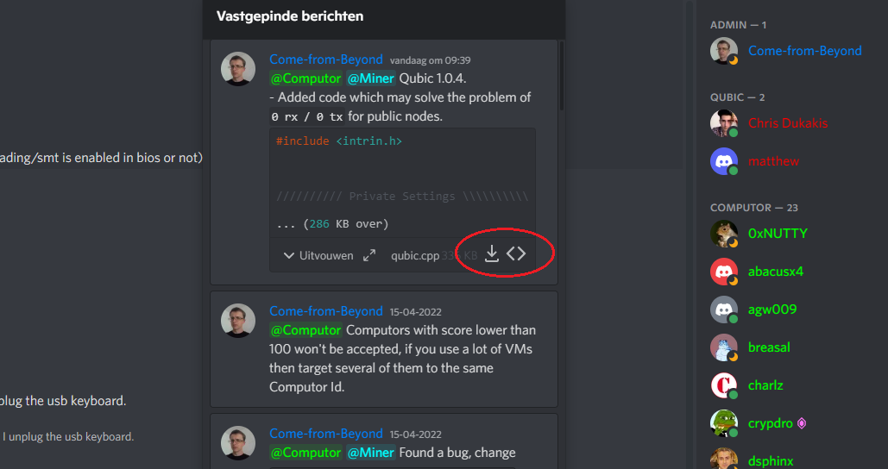
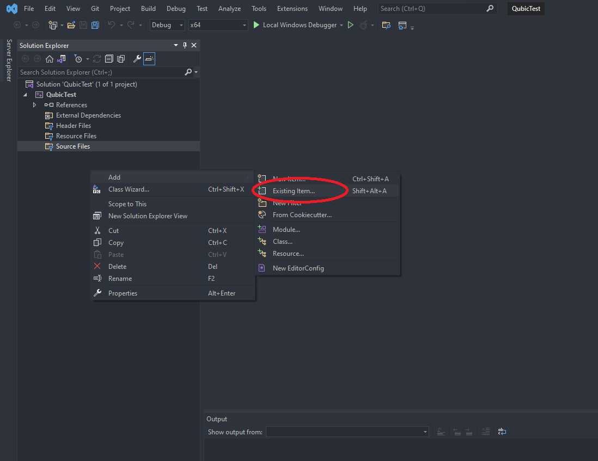

# Qubic a quorum-based computations protocol.

In this tutorial we'll setup a [Qomputor](https://www.computors.org/computing/qomputor "Qomputor") Node (A mining node will maybe require an other approach), we try to make this tutorial as easy as possible but some knowledge of computer systems is definitely required. This tutorial is a community initiative. For more information or questions join [Syzygy Discord ](https://discord.gg/2vDMR8m "Syzygy Discord").

Qubic software is running on baremetal machines without any OS installed, the software is a so called UEFI application and for security reasons we compile it ourselves with the .cpp files provided by [Come-from-Beyond](https://twitter.com/c___f___b "Twitter"). The latest releases will always be on [Syzygy Discord ](https://discord.gg/2vDMR8m "Syzygy Discord").

Because we use a UEFI application, the successful use of the software is very dependent on the system that is used. Here are some examples of motherboard/cpu combinations that have been tested and which are working successfully.

| Motherboard        | CPU         | RAM  | Connection |
| ------------------ |:-----------:| ----:| -------:   |
| MSI B450-A PRO MAX | Ryzen 3950x | 64GB | 1gbps      |

For now, the exact conditions for a successful system are not yet available. 

# Hardware Requirements
* Highend CPU
* Motherboard which accept unsecure UEFI software (disable secure boot)
* 64GB Ram
* 1GBps internet connection
* 128GB USB Stick

# Software Requirements
* Qubic.cpp file
* [Visual Studio Code Community 2022](https://visualstudio.microsoft.com/vs)
* [Rufus](https://rufus.ie)

# The steps we will take to achieve a successful running efi application

1. Prepare motherboard/bios settings
3. Compiling Qubic
4. Prepare USB
5. Run

# Preparing motherboard and bios settings 

Since every motherboard is different, it is advisable to consult the manual if you cannot find certain settings. There are a number of important things that need to be set up.

1. Make sure motherboard can run or boot with UEFI
2. Disable secure boot
3. Change boot order to USB (uefi)
4. Set time to 00:00 UTC
5. Make sure network stack is available (if not then maybe you need to install drivers, we'll be covering this later and its yet not described in this tutorial)

# Compiling Qubic with Visual Studio Code Community 2022

1. Install Visual Studio Code Community 2022, while installing make sure the Desktop Development with C++ components are installed. If you already had installed Visual Studio Code you install the components at Tools >> Get Tools and Features.

2. When we start Visual Studio we need to create a new project make sure you use the following settings.

3. Give the project a name

4. When the project file is succesfully made and opened we are going to add the latest .cpp file from our [Discord Server](https://discord.gg/2vDMR8m "Syzygy Discord"). ( they are in the #qubic channel in the pinnend messages.)

5. When downloaded load it in the project.

